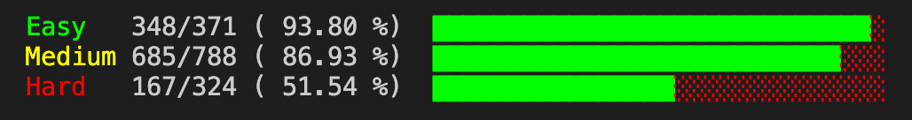
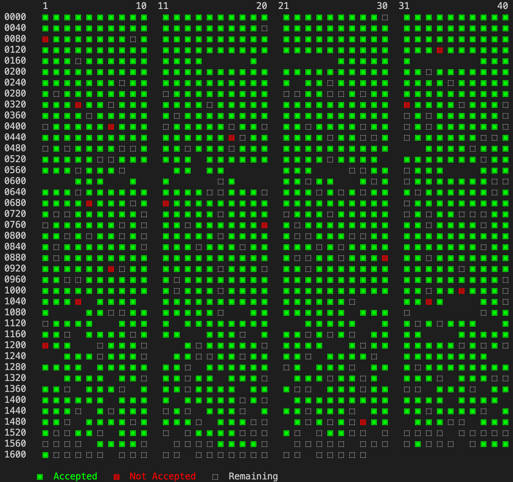

# Leetcode Solutions

I have solved around 1200 questions over 1 year. The recent most accepted solution can be found in the solutions folder. 

## How to extract leetcode solutions

1. Install `leetcode-cli` by running `npm install -g leetcode-cli`
1. Install Chrome Plugin by running `leetcode plugin -i cookie.chrome`
1. Login using `leetcode user -l -v`. However if this doesn't work it is because Leetcode introduced reCaptcha. To overcome this, login normally using your browser and follow instructions [here](https://github.com/skygragon/leetcode-cli/issues/194#issuecomment-559839631)
1. Goto https://leetcode.com/api/problems/all/ and download the json to `metadata.json` in the root directory. On chrome an easy way to do this is going to `view-source:https://leetcode.com/api/problems/all/` and copy pasting the json data.
1. Run `python create_bash_script.py`
1. Run `sh get_ac.sh`

## Statistics

## Credits
The code uses snippets from this article: https://www.foxerlee.top/2020/02/05/Leetcode-crawler/

